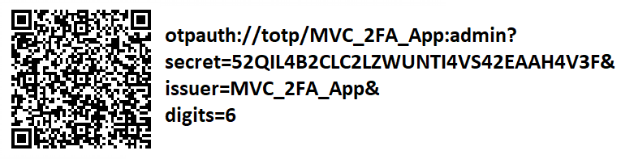

# 🎯 Net8MVC2FA

Aplicación web construida con **ASP.NET Core MVC (.NET 8)** que implementa autenticación en dos pasos (2FA), para ser usado con apps como **Microsoft Authenticator** o **Google Authenticator**. Ideal para pruebas educativas y despliegue en entornos controlados.

---

## 🚀 Características

- Aplicación MVC Web desarrollada con ASP.NET Core.

---

## 🛠️ Tecnologías utilizadas

- .NET 8 (ASP.NET Core MVC)
- BCrypt para hash de contraseñas
- TOTP (Time-based One-Time Password)
- Linux Ubuntu 22.04 (AWS)

---

## 🌐 URL en línea

> http://{Dirección IPv4 pública de AWS}:5000/

Usa una lista de usuarios en memoria **simulando una BD** al iniciar el proyecto:

```csharp
Usuarios = new List<Usuario>
{
    new Usuario
    {
        Nick = "admin",
        PwdHash = BCrypt.Net.BCrypt.HashPassword("1234"),
        Requiere2FA = true,
        RequiereQR = true,
        SecretKey = Base32Encoding.ToString(KeyGeneration.GenerateRandomKey(20))
    },
    new Usuario
    {
        Nick = "cpenac",
        PwdHash = BCrypt.Net.BCrypt.HashPassword("1234"),
        Requiere2FA = true,
        RequiereQR = true,
        SecretKey = Base32Encoding.ToString(KeyGeneration.GenerateRandomKey(20))
    },
    new Usuario
    {
        Nick = "aestrada",
        PwdHash = BCrypt.Net.BCrypt.HashPassword("1234"),
        Requiere2FA = true,
        RequiereQR = true,
        SecretKey = Base32Encoding.ToString(KeyGeneration.GenerateRandomKey(20))
    }
};
```

---

## 🔐 Código QR para 2FA

Este es un ejemplo del QR generado para el usuario `admin` con la siguiente URI:

```bash
otpauth://totp/MVC_2FA_App:admin?secret=52QIL4B2CLC2LZWUNTI4VS42EAAH4V3F&issuer=MVC_2FA_App&digits=6
```



---

## ▶️ Cómo ejecutar en AWS (Ubuntu Server)

### 1. Actualizar paquetes del sistema

```bash
sudo apt update && sudo apt upgrade -y
```

### 2. Instalar dependencias necesarias

```bash
sudo apt install -y wget apt-transport-https
```

### 3. Agregar el repositorio de Microsoft

```bash
wget https://packages.microsoft.com/config/ubuntu/22.04/packages-microsoft-prod.deb -O packages-microsoft-prod.deb
sudo dpkg -i packages-microsoft-prod.deb
```

### 4. Instalar .NET Runtime 8

```bash
sudo apt update
sudo apt install -y dotnet-runtime-8.0 aspnetcore-runtime-8.0
```

### 5. Copiar y ejecutar la aplicación

```bash
cd /home/ubuntu/app
sudo dotnet WebAppSSO.dll --urls "http://0.0.0.0:5000"
```

---

## 👥 Autores

**Grupo 01**  
- Antonio Estrada  
- Carlos Peña  

---

## 📄 Licencia

Este proyecto es de uso libre para fines educativos y personales.  
No se permite su uso con fines comerciales sin autorización previa.